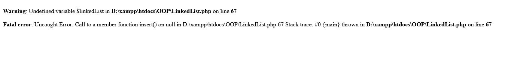
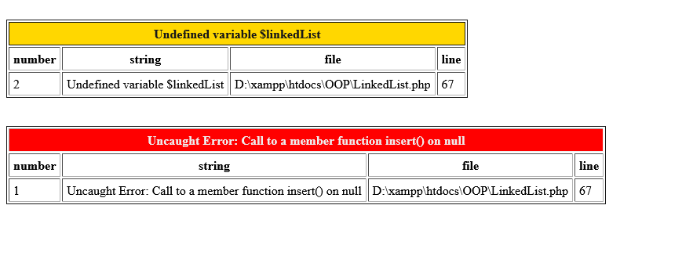

# Error Handler for PHP Errors

Show errors in php in nicely way, take error information like message, file, and line and put them in table for make the error readable.

### How to use?

It's sample to use, just require PHPErrorHandler.php in top of your file and that's it work.

#### Before using Error Handler

#### After using Error Handler

